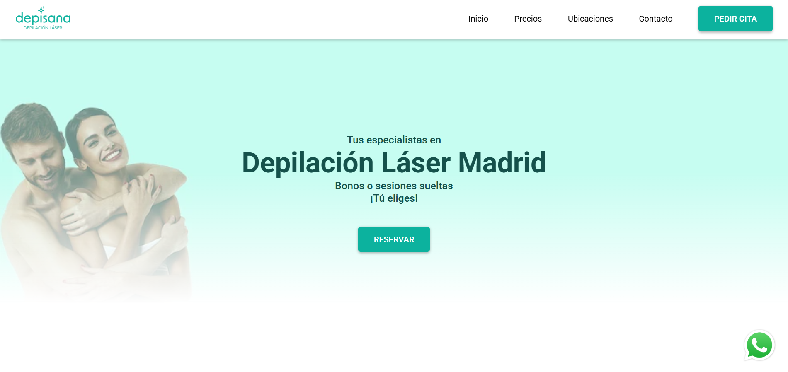
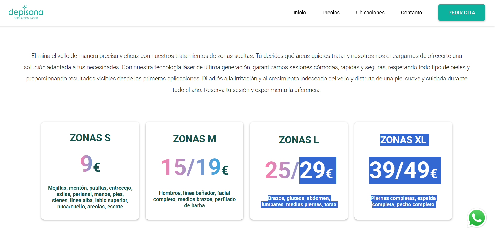
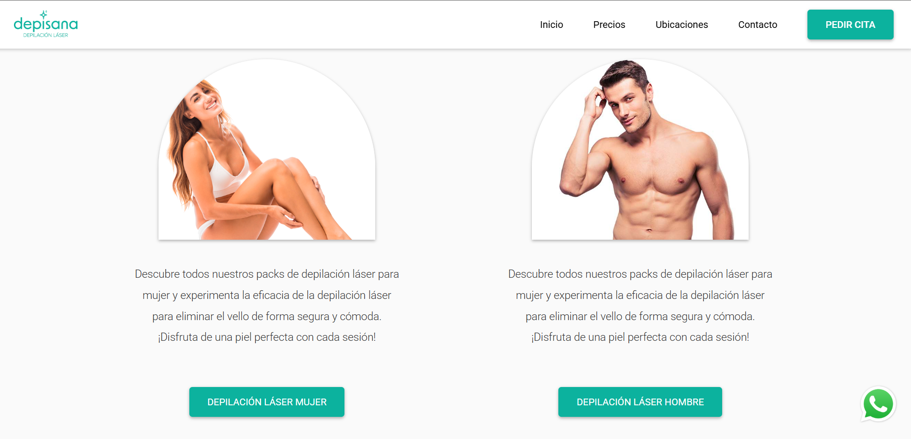

# Web para Depisana (2024)

Sitio web corporativo desarrollado en 2024 para una empresa de depilación láser. Proyecto enfocado a reforzar la presencia online, presentar servicios de forma clara y facilitar el contacto y la captación de clientes.

## Descripción
Página web de presentación con estructura sencilla y navegación directa, orientada a convertir visitas en contactos. Incluye enlaces directos a WhatsApp y acceso a un servicio externo de reservas.

## Tecnologías
- HTML
- CSS
- JavaScript

## Funcionalidades
- Secciones informativas (servicios, precios, clínicas)
- Diseño responsive (móvil / tablet / escritorio)
- Enlaces directos a canales de contacto (WhatsApp y reservas)

## Capturas
<table align="center">
  <tr>
    <td align="center" valign="top" width="33%">
      <strong>Inicio</strong>  
      
    </td>
    <td align="center" valign="top" width="33%">
      <strong>Precios</strong>  
      
    </td>
    <td align="center" valign="top" width="33%">
      <strong>Servicios</strong>  
      
    </td>
  </tr>
</table>
